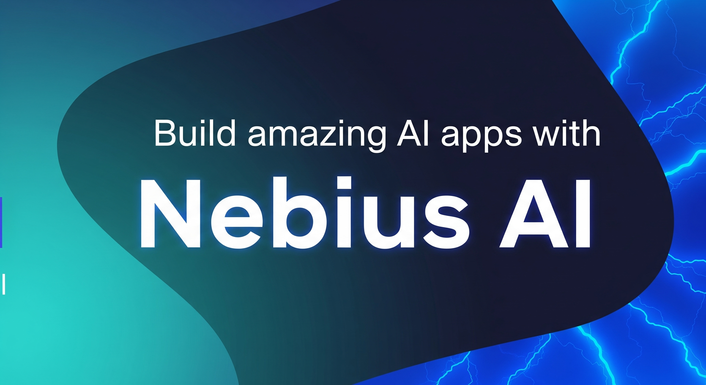

# Nebius AI Studio Cookbook

This cookbook respository is a collection of guides and examples for working with open models using [Nebius AI Studio](https://studio.nebius.com/). Use these recipes to build and deploy intelligent applications faster.

> ⭐ If you find this repo useful, give it a star! You’ll be notified of new updates and help others discover it too — thank you!

---

## 😎 Featured

- New [model guides](models/README.md): [GPT-OSS](models/gpt-oss.md), [Qwen3-2507](models/qwen3-2507.md), [GLM4.5](models/glm4.5.md)
- Community contributions: [open bench evaluation guide](community/openbench-evaluation-guide/)
- [Distillation guide](distillation/distillation-1/)
- [Fun benchmark "pelican riding a bicycle"](fun/pelican-riding-bicycle/)

### 💪 [Cool Apps / Demos](apps/README.md)

See apps powered by Nebius AI - WhatLLM, Streetfighter and more

---

## 🚀 Getting Started

1. Prerequisites:
   - You’ll need a Nebius AI Studio account and API key. Sign up for free [here](https://studio.nebius.com/).
   - Python runtime (local, Google Colab etc.)
2. Follow the [setup guide](setup-dev-env.md)
3. Follow project-specific instructions**

---

## 🎁 [Models](models/)

Checkout latest [model guides and sample code](models/).

Featuring: [Qwen3-2507](models/qwen3-2507.md) and [GPT-OSS](models/gpt-oss.md)

---

## 📘 [APIs](api/)

Access AI Studio using various APIs.

[Open AI comptible API](api/api_native.ipynb)
&nbsp;  • &nbsp;  [LiteLLM](api/api_litellm.ipynb)
&nbsp;  • &nbsp;  [ai-suite](api/api_aisuite.ipynb)
&nbsp;  • &nbsp;  [llama-index](api/api_llamaindex.ipynb)

---

## 🕶️ [Fun and Cool Stuff](fun/)

Have some fun with models.  
- Try ["Pelican Riding a bicycle" benchmark](fun/pelican-riding-bicycle/)
- creating cool images using LORA.

---

<!-- ## Embeddings -->

## 🔍 [RAG](rag/)

| Example                             | Description                                         | Tech Stack                         |
|-------------------------------------|-----------------------------------------------------|------------------------------------|
| [PDF RAG](rag/rag-pdf-llama-index/) | Simple PDF RAG application                          | LLamaindex + Nebius AI     |
| [Chat with Documents](rag/chat-with-pdf)  | UI Web app to chat interactively with PDF documents | LLamaindex + Nebius AI + Streamlit |

---

## 🎠 [Agents](agents/)

We have numerous  agent examples: from [starter agents](agents/README.md#-starter-agents) to [intermediate agents](agents/README.md#intermediate-agents) and [advanced agents](agents/README.md#advanced-agents).

**Featured AI Agent frameworks:**  
[ CrewAI](agents/README.md#crewai)
&nbsp;  • &nbsp; [ Agno](agents/README.md#agno)
&nbsp;  • &nbsp; [ Google ADK](agents/README.md#google-adk-agent-development-kit)
&nbsp;  • &nbsp; [ Llama-index](agents/README.md#llama-index)
&nbsp;  • &nbsp; [ Pydantic](agents/README.md#pydantic-ai)
&nbsp;  • &nbsp; [ AWS Strands](agents/README.md#strands-agent)

---

## ⚒️ Function / Tool Calling

| Example                             | Description                                         | Tech Stack                         |
|-------------------------------------|-----------------------------------------------------|------------------------------------|
| [simple function calling example 1](tool-calling/function_calling_1.ipynb) | Demonstrates how to call functions                          | Nebius AI     |

---

<!-- ## Vision Modes

## Observability

## MCP

## Finetuning -->

## 🫗 Distillation

| Name | Descripton                                          | Tech Stack           |
|-----------|-----------------------------------------------|-----------------------|
| [Distillation 1](distillation/distillation-1/)  | Example of a distilled model to do grammer check   | Nebius AI | 

<!-- ## LORA -->

---

## 🤝 Contributing

We welcome your contributions!  Open issues, submit pull requests, share your experience.

🧑🏻‍🤝‍🧑🏼 **[View community contributions](community/README.md)**

---

## 📜 License

This project is licensed under the MIT License. See the [LICENSE](LICENSE) file for details.

---

## 📔 Resources

- [Nebius AI Studio Docs](https://docs.nebius.com/studio)
- [Nebius AI Blog](https://nebius.com/blog)

---
© Nebius BV, 2025

