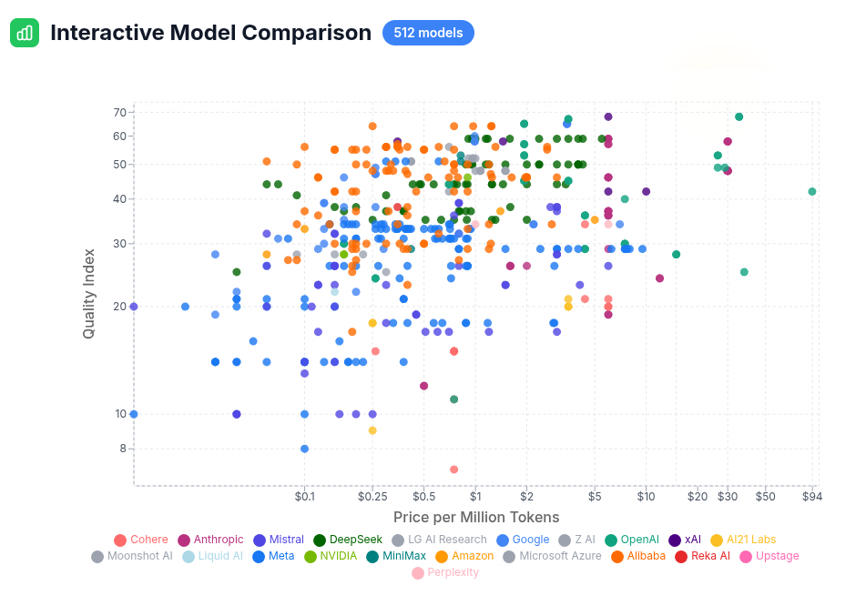
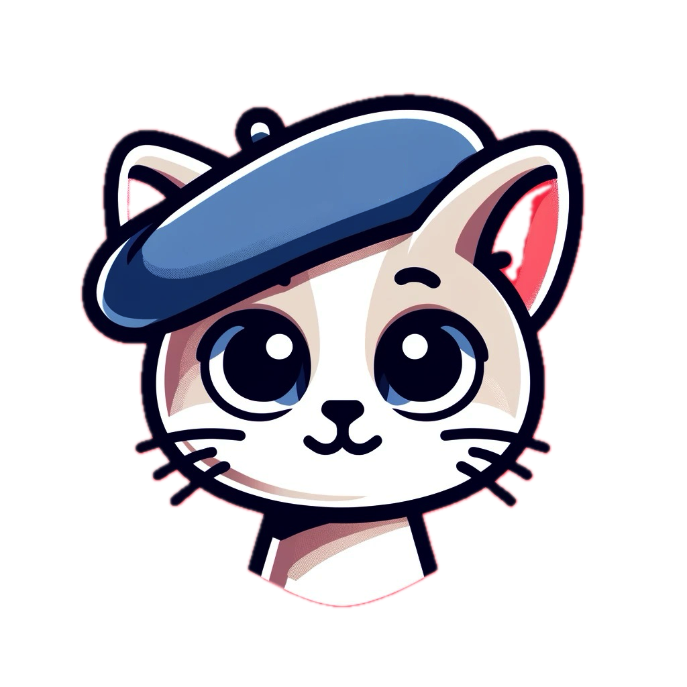

# Cool Apps and Demos built with Nebius AI

  - [WhatLLM](#whatllm)
  - [LLM Streetfighter!](#llm-streetfighter)
  - [Allycat](#allycat)

## WhatLLM

A cool and very useful LLM comparision tool

[whatllm.org](https://www.whatllm.org/)

Built by Dylan Bristot: [demianarc](https://github.com/demianarc)  |  [demian_ai](https://twitter.com/demian_ai)

| 
|-

---

## LLM Streetfighter!

This will bring back the nostalgia of arcade games!

coming soon.

| 
|-

---

## Allycat

[Allycat](https://github.com/The-AI-Alliance/allycat) can scrape a website, index its contents and allow chatting with the website content using LLMs running on Nebius AI Studio or locally.

Author: [Sujee Maniyam](https://sujee.dev/)  |   [@sujee_dev](https://x.com/sujee_dev/)

| 
|-

---

