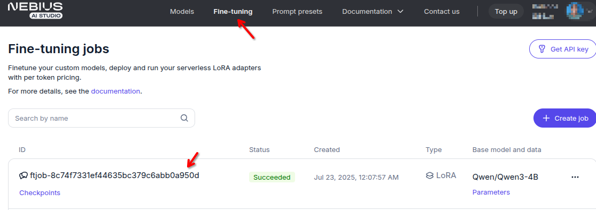
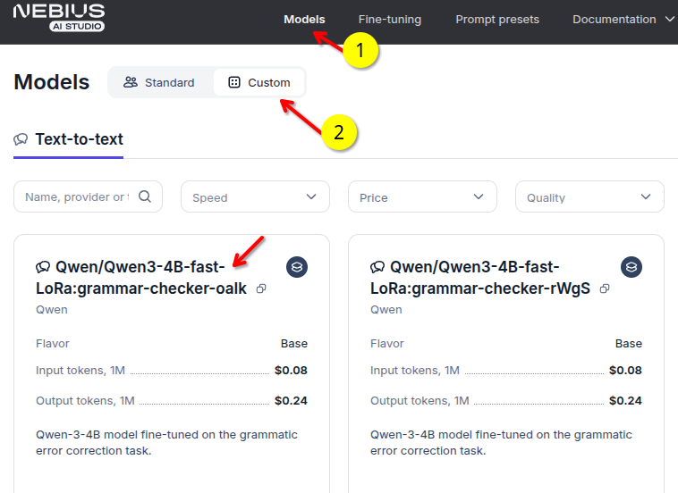
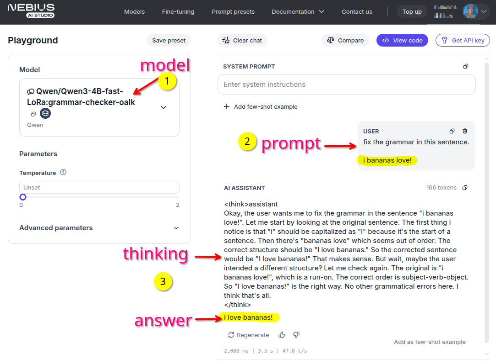

# Distillation Example

In this tutorial, we demonstrate how to perform distillation using **Nebius AI Studio** to create a grammar-correcting model. We will:  

1. Generate high-quality training data via batched LLM generation using the recently released **Qwen3-235B-A22B**.
2. Fine-tune a **Qwen3-4B** non-reasoning student model using LoRA adapters  
3. Deploy, evaluate and compare the distilled model with a 3.5x times larger model of this family, **Qwen3-14B**, using the most powerful open-source LLM to date, **DeepSeek-R1**, as evaluator.

  - [Understanding Distillation](#understanding-distillation)
  - [1 - Setup](#1---setup)
  - [2 - Running the code](#2---running-the-code)
  - [3 - Generate Synthetic Data](#3---generate-synthetic-data)
  - [4 - Fine tuning](#4---fine-tuning)
  - [5 - Verifing the distilled model](#5---verifing-the-distilled-model)
  - [6 - Your distilled model in Nebius Studio](#6---your-distilled-model-in-nebius-studio)
  - [7 - Using your distilled model](#7---using-your-distilled-model)
  - [8 - Use the distilled model using an API](#8---use-the-distilled-model-using-an-api)
  - [References](#references)


## Understanding Distillation

For more details on how distillation works see : **[Distillation explained](distillation-explained.md)**


## 1 - Setup


**1. Get the code**

```bash
git   clone    https://github.com/nebius/ai-studio-cookbook/
cd    distillation/distillation-1
```

**2. Install dependencies:**

If using `uv` (preferred)

```bash
uv sync

uv add --dev ipykernel   # only when setting up UV for first time

source .venv/bin/activate
python -m ipykernel install --user --name="distillation-1" --display-name "distillation-1"
# select this kernel when running in jupyter / vscode
```

If using `pip`

```bash
python -m venv venv
source venv/bin/activate
pip install -r requirements.txt
python -m ipykernel install --user --name="distillation-1" --display-name "distillation-1"
# select this kernel when running in jupyter / vscode
```

**3 - Create .env file**

Create a `.env` file in the project root and add your Nebius API key:

```bash
cp env.example .env
```

```
NEBIUS_API_KEY=your_api_key_here
```

## 2 - Running the code

Using `uv`

```bash
uv run --with jupyter jupyter lab
```

Using standard python/pip

```bash
jupyter lab 
```

Using VSCode
- open the notebook
- run with custom jupyter kernel we created in step-1

Run the notebooks in the following order


## 3 - Generate Synthetic Data

We are going to use a powerful LLM `Qwen3-235B-A22B` to create some synthetic data from [C4-200M](https://huggingface.co/datasets/liweili/c4_200m) dataset 

We are going to run this using **batch inference** mode.

The runtime can take anywhere from 1 to 24 hours.

Note: we only have to do this once.  Then we can use the generated output.

Run this notebook: [1_generate_synthetic_data_batch.ipynb](1_generate_synthetic_data_batch.ipynb)

After successful completion we will see a file `data/batch_output.jsonl` .

## 4 - Fine tuning

We use the data we generated in previous step to fine tune a 'student model'

The fine tuned model will be saved into `models` directory.

Run this notebook:  [2_fine_tuning.ipynb](2_fine_tuning.ipynb)

You can see fine tuning jobs' status on the [Studio fine-tuning dashboard](https://studio.nebius.com/fine-tuning) 



## 5 - Verifing the distilled model

This notebook will show how to evaluate our distilled model ('student' model)

We will use another powerful LLM **DeepSeek-R1** as an evaluator

Run notebook: [3_evaluate_model.ipynb](3_evaluate_model.ipynb)

## 6 - Your distilled model in Nebius Studio

Find your distilled models in **models --> custom** section



## 7 - Using your distilled model

Try your new shiny model in the playground!

Here you see the **distilled model** performing an  grammer correction 



## 8 - Use the distilled model using an API

See our [API examples](../../api/README.md)

And [documentation](https://docs.nebius.com/studio/inference/quickstart)


## References

1. Stahlberg, F., & Kumar, S. (2021). Synthetic data generation for grammatical error correction with tagged corruption models. In Proceedings of the 16th Workshop on Innovative Use of NLP for Building Educational Applications (pp. 37–47). Association for Computational Linguistics. https://www.aclweb.org/anthology/2021.bea-1.4
2. Qwen Team. (2025, April 29). *Qwen3: Think deeper, act faster*. Qwen Blog. https://qwenlm.github.io/blog/qwen3/
3. Edward J. Hu, Yelong Shen, Phillip Wallis, Zeyuan Allen-Zhu, Yuanzhi Li, Shean Wang, Lu Wang and Weizhu Chen. LoRA: Low-Rank Adaptation of Large Language Models. The Tenth International Conference on Learning Representations, ICLR 2022, Virtual Event, April 25-29, 2022, 2022. https://openreview.net/forum?id=nZeVKeeFYf9
4. Napoles, C., Sakaguchi, K., & Tetreault, J. (2017). JFLEG: A fluency corpus and benchmark for grammatical error correction. In Proceedings of the 15th Conference of the European Chapter of the Association for Computational Linguistics: Volume 2, Short Papers (pp. 229–234). Association for Computational Linguistics. http://www.aclweb.org/anthology/E17-2037


