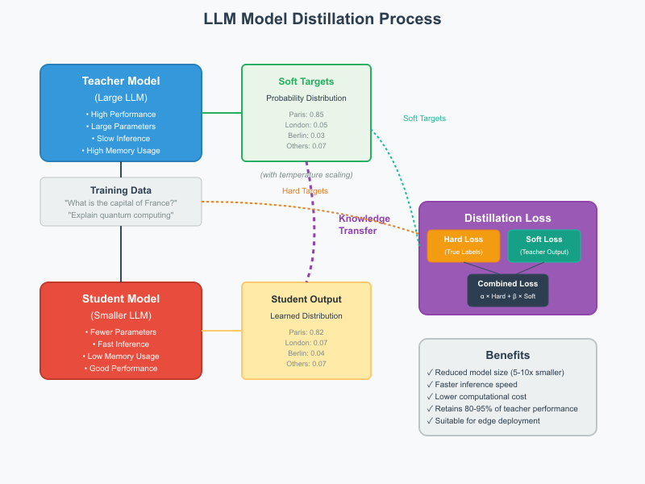

# Understanding Distillation

  - [Distillation of LLM Models](#distillation-of-llm-models)
  - [How LLM Distillation Works](#how-llm-distillation-works)
    - [Key Components:](#key-components)
  - [The Distillation Process](#the-distillation-process)
  - [Benefits of LLM Distillation](#benefits-of-llm-distillation)
  - [Real-World Applications](#real-world-applications)
  - [Distillation vs Fine-tuning](#distillation-vs-fine-tuning)
    - [Core Purpose](#core-purpose)
    - [Architecture Changes](#architecture-changes)
    - [Training Process](#training-process)
    - [Data Requirements](#data-requirements)
    - [Computational Resources](#computational-resources)
    - [Use Cases](#use-cases)
    - [Performance Outcomes](#performance-outcomes)
    - [Can They Be Combined?](#can-they-be-combined)
    - [Analogy](#analogy)
    - [When to Choose Which](#when-to-choose-which)

## Distillation of LLM Models

Model distillation is a technique for creating smaller, more efficient neural networks by training a "student" model to mimic the behavior of a larger, more complex "teacher" model. In the context of Large Language Models (LLMs), this process helps create compact models that retain much of the original model's capabilities while being faster and requiring less computational resources.

## How LLM Distillation Works

The core idea is to transfer knowledge from a large, pre-trained teacher model to a smaller student model. Instead of training the student model only on the original training data and hard labels, it learns from the teacher's "soft" outputs - the probability distributions over the vocabulary that contain richer information about the model's understanding.

### Key Components:

**Teacher Model**: A large, well-trained LLM (e.g., GPT-4, Claude) that serves as the knowledge source

**Student Model**: A smaller architecture that will be trained to approximate the teacher's behavior

**Distillation Loss**: Combines the traditional training loss with a knowledge distillation loss that measures how well the student matches the teacher's output distributions

**Temperature Scaling**: A technique that softens the probability distributions, making the knowledge transfer more effective

## The Distillation Process

The student model is trained on a combination of:
- **Hard targets**: The actual correct answers from the training data
- **Soft targets**: The probability distributions from the teacher model, typically softened with temperature scaling

The loss function typically combines cross-entropy loss on the hard targets with KL divergence between the student and teacher distributions.

## Benefits of LLM Distillation

**Efficiency**: Distilled models are significantly smaller and faster, making them suitable for deployment on resource-constrained devices or for applications requiring low latency.

**Performance Retention**: Well-distilled models can retain 80-95% of the teacher's performance while being 5-10x smaller.

**Specialization**: The process can be tailored for specific tasks or domains, creating focused models that excel in particular areas.

**Cost Reduction**: Smaller models require less computational power for inference, reducing operational costs.

**Progressive Distillation**: Training multiple intermediate-sized models in sequence, where each serves as a teacher for the next smaller model.

**Task-Specific Distillation**: Tailoring the distillation process for specific downstream tasks, often achieving better performance than general distillation.

**Feature-Based Distillation**: Matching intermediate layer representations between teacher and student, not just final outputs.

**Attention Transfer**: Specifically transferring attention patterns from the teacher to help the student learn what to focus on.

## Real-World Applications

Many production LLM systems use distillation, including mobile applications, chatbots with latency requirements, and edge computing scenarios. Companies like Google, Microsoft, and OpenAI have released distilled versions of their larger models (like DistilBERT, smaller GPT variants) that maintain strong performance while being much more practical for deployment.

The key to successful distillation is balancing the trade-off between model size reduction and performance retention, often requiring careful tuning of the loss function weights and temperature parameters.

## Distillation vs Fine-tuning

While both distillation and fine-tuning are techniques for adapting language models, they serve different purposes and work in fundamentally different ways:

### Core Purpose

**Distillation** is about **model compression** - creating a smaller, faster model that mimics a larger teacher model's behavior while maintaining similar performance.

**Fine-tuning** is about **task specialization** - adapting an existing model to perform better on specific tasks or domains by continuing training on targeted data.

### Architecture Changes

**Distillation**: The student model typically has a **different, smaller architecture** than the teacher (fewer layers, smaller hidden dimensions, fewer parameters).

**Fine-tuning**: Uses the **same model architecture** - you're just updating the weights of an existing pre-trained model.

### Training Process

**Distillation**:
- Requires both a teacher model and training data
- Student learns from teacher's probability distributions (soft targets)
- Loss function combines hard labels + soft targets from teacher
- Creates a new, independent model

**Fine-tuning**:
- Starts with a pre-trained model's weights
- Continues training on task-specific data
- Uses standard cross-entropy loss with hard labels
- Modifies the existing model's parameters

### Data Requirements

**Distillation**: Can use the same data the teacher was trained on, or even unlabeled data (teacher generates the labels).

**Fine-tuning**: Requires labeled data specific to the target task or domain.

### Computational Resources

**Distillation**:
- Requires running the large teacher model during training (expensive)
- Results in efficient inference after training
- One-time high cost, long-term savings

**Fine-tuning**:
- Generally less computationally expensive during training
- Final model size depends on starting model
- More accessible for most practitioners

### Use Cases

**Distillation is ideal for**:
- Deploying models on mobile devices or edge hardware
- Reducing inference costs in production
- Creating specialized models for specific hardware constraints
- When you need speed but want to maintain general capabilities

**Fine-tuning is ideal for**:
- Adapting models to specific domains (medical, legal, etc.)
- Improving performance on particular tasks
- Adding new capabilities or knowledge to existing models
- When you have task-specific data but computational resources are limited

### Performance Outcomes

**Distillation**: The student model typically achieves 80-95% of teacher performance while being 5-10x smaller and faster.

**Fine-tuning**: Can achieve equal or better performance than the base model on target tasks, but may lose some general capabilities.

### Can They Be Combined?

Yes! You can:
1. **Fine-tune then distill**: First fine-tune a large model on your specific task, then distill it into a smaller model
2. **Distill then fine-tune**: Start with a distilled model and fine-tune it for your specific use case
3. **Task-specific distillation**: Use a fine-tuned model as the teacher for distillation

### Analogy

Think of **distillation** like creating a "pocket-sized summary" of a large textbook that captures the essential knowledge in a more compact form.

**Fine-tuning** is like taking that textbook and adding specialized chapters or updating existing content to focus on a particular subject area.

### When to Choose Which

**Choose Distillation when**:
- Model size/speed is the primary concern
- You need to deploy at scale or on constrained hardware
- You want to maintain broad capabilities but in a smaller package

**Choose Fine-tuning when**:
- You have specific task/domain requirements
- You have relevant labeled data
- Model size isn't the primary constraint
- You want to improve performance on particular tasks

Both techniques are valuable tools in the ML practitioner's toolkit, and the choice depends on your specific constraints and goals.