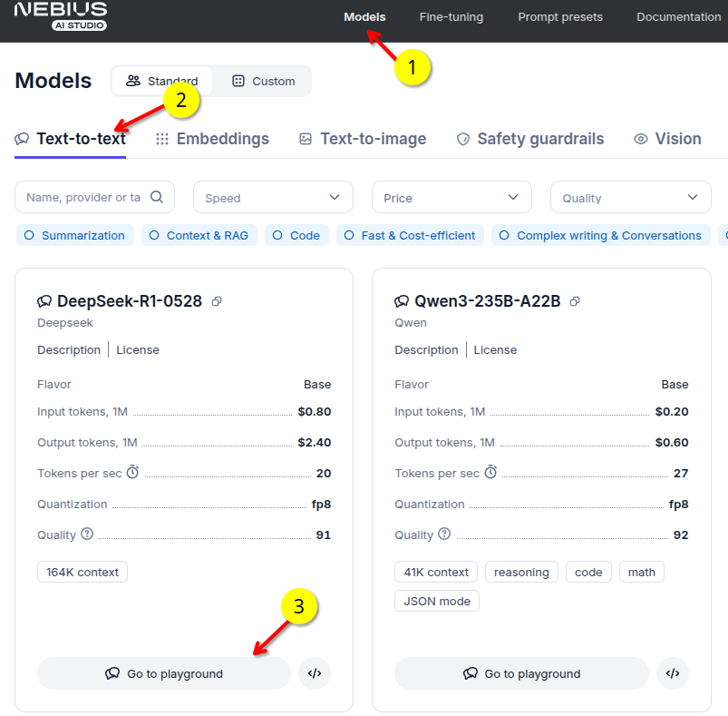
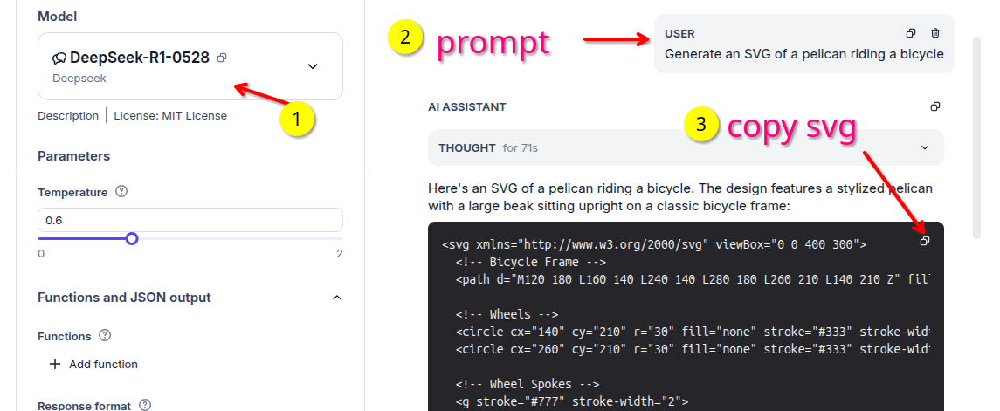
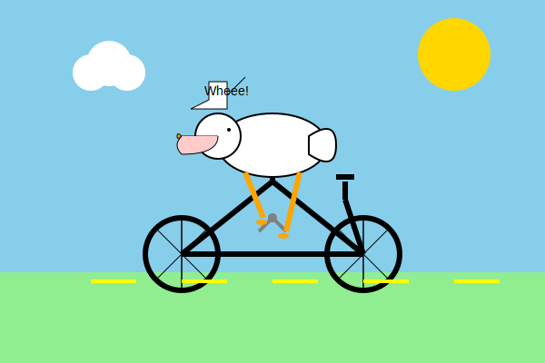
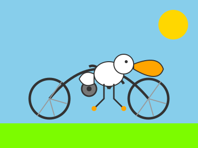
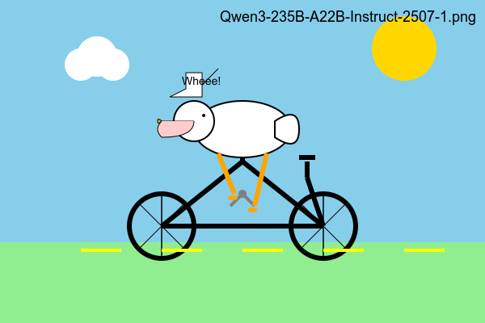

# Pelican Riding a Bicycle - A fun vibe benchmark

This is inpired by [Simon Willison](https://simonwillison.net/)'s experiment called [pelican riding a bicycle](https://simonwillison.net/tags/pelican-riding-a-bicycle/).  It has become a cool vibe benchmark to evaluate LLMs.  
Original github repo: [simonw/pelican-bicycle](https://github.com/simonw/pelican-bicycle)

## How to run it

It is very simple.  Issue the the following prompt on playground of any model (text to text model)

> Generate an SVG of a pelican riding a bicycle

It will generate a SVG code snippet.  Copy it and save it as an svg file (e.g. `image.svg`)

See the screenshots below.





You can view SVG file using any browser and modern graphic programs.

## Generated Images

You can find [generated images here](images/).

Annotated images (with model names) can found in in [images/annotated](images/annotated/)

**Qwen3-235B-A22B-Instruct-2507.SVG**  ([png](images/Qwen3-235B-A22B-Instruct-2507-1.png))



**DeepSeek-R1-0528-1.svg**  ([png](images/DeepSeek-R1-0528-1.png))




### Handy Scripts

### SVG --> PNG

You can also convert SVG into other image formats like PNG.  Here is how to do it in command line 

```bash
## using Image Magic's convert
convert input.svg output.png

## Using inkscape
inkscape --export-type=png --export-filename=output.png input.svg
```

### Batch conversion of SVG --> PNG

[convert2png.sh](convert2png.sh) can convert multiple SVGs into PNG.  It also generates 'annotated' PNGs with model name.  This is handy to identify which images were generated by which model

Usage:

```bash
./convert2png.sh images/Qwen3-235B-A22B-*.svg
```

Here is an example of generated PNGs (plain and annotated) 😀




### Combining images

[combine-images.sh](combine-images.sh) is a handy script that can combine multiple images into a single image.  Handy to create a A/B comparison image.

Usage:

```bash
./combine-images.sh -o combined.png  a.png   b.png

## to lay images out in a 2x2 grid
./combine-images.sh -o combined.png  --layout 2x2  a.png   b.png  c.png  d.png

```

Here as an example of generated combined image comparing **Qwen3-235B-A22B** and **Qwen3-235B-A22B-Instruct-2507** models


## References

- github: [simonw/pelican-bicycle](https://github.com/simonw/pelican-bicycle)