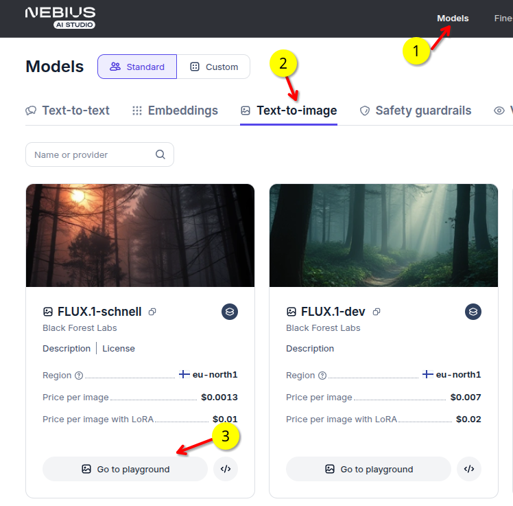
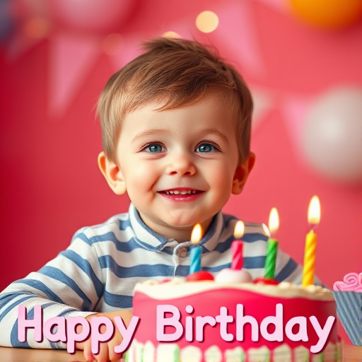
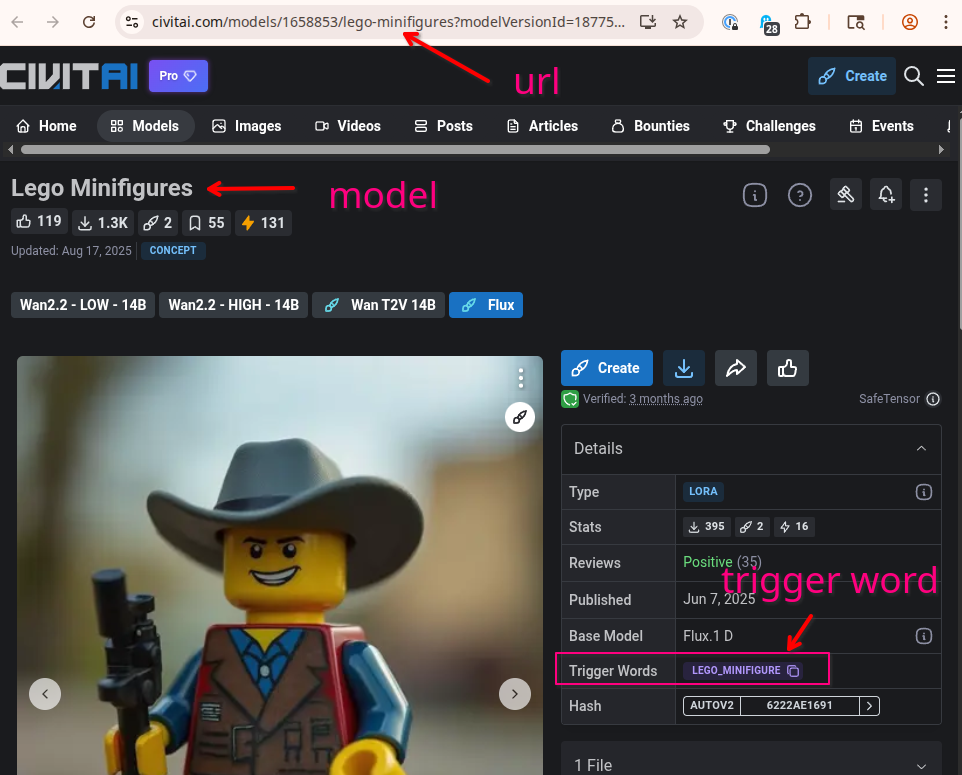
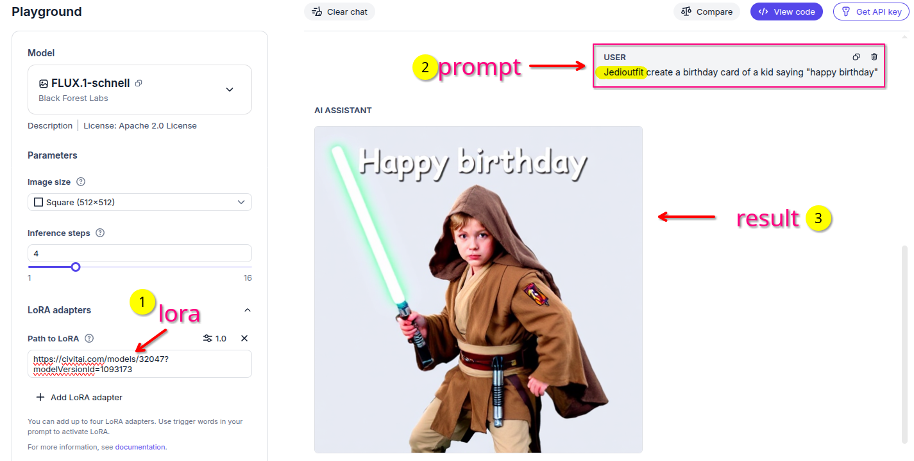
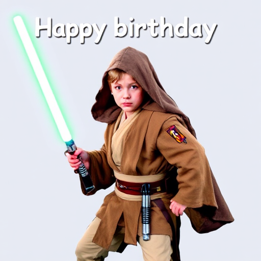
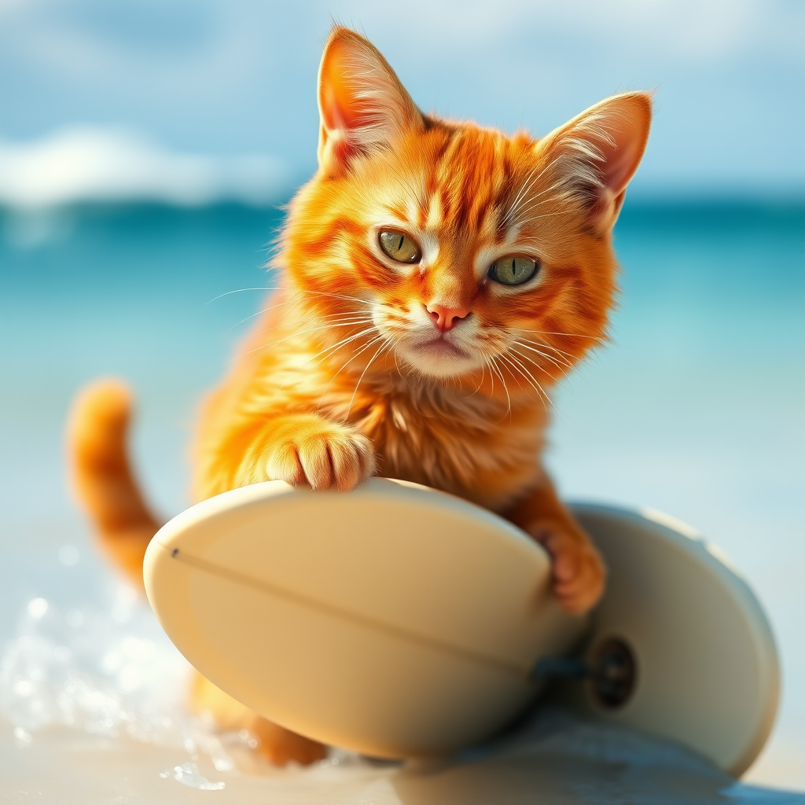
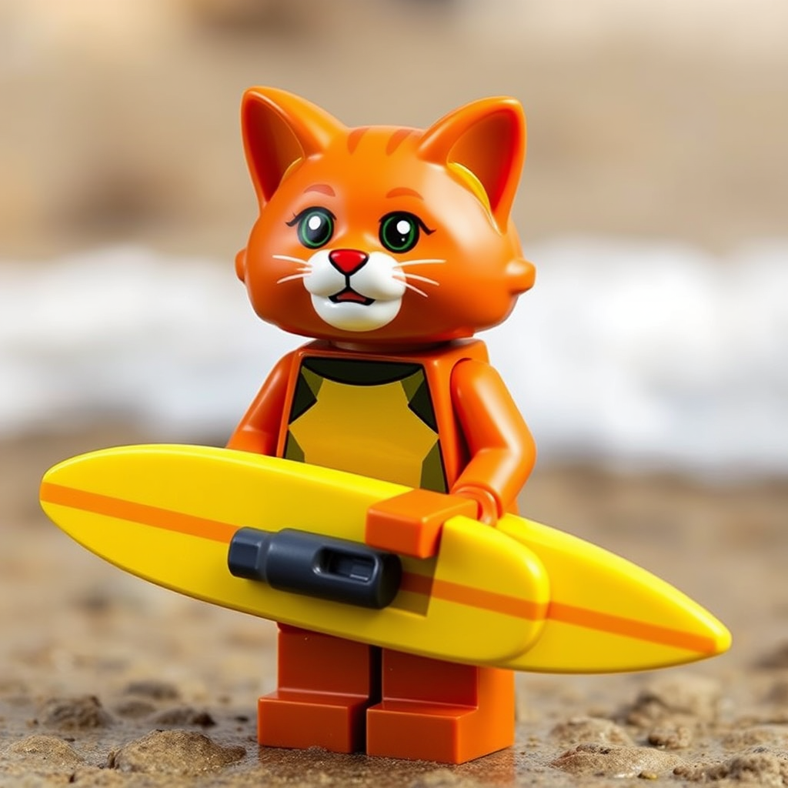

# Create Fun images Using LORA Adapters on AI Studio

  - [Overview](#overview)
  - [Pre-Requisites](#pre-requisites)
  - [Quick start](#quick-start)
  - [Example 2](#example-2)
  - [Dev Notes](#dev-notes)


## Overview

You can use LoRA adapters directly in the [Nebius AI Studio](https://studio.nebius.com/) UI.  This guide shows how to plug in a LoRA and make cool, themed images.

**Watch the video**

[](https://www.youtube.com/watch?v=f060_TGIeMg)

## Pre-Requisites

- Nebius Studio account.  Get a free one [here](https://studio.nebius.com/)

## Quick start

### 1 - Select a model

- Open [Nebius AI Studio](https://studio.nebius.com/)
- Go to 'Text to image' section
- select the model **`FLUX.1-schnell`**

| 
|-

<!-- ### 2 - Create a base image

Prompt:

> create a birthday card of a kid saying "happy birthday" 

And here the image

 -->

### 2 - Using a LORA Adapter

A great place to find LoRA adapters is [civitai.com](https://civitai.com/)

To use a LORA adapter, you’ll need two things:

- The **adapter URL**
- The **trigger word** (must be included in your prompt)

If the trigger word is **XYZ**, your prompt might look like:

> **XYZ** a cat wearing sun glasses
  
See the screenshot below for where to find the URL and trigger word on Civitai.

| 
|-

Some fun adapters to try:

- [lego minifugures](https://civitai.com/models/1658853/lego-minifigures?modelVersionId=1877566)
- [Simpsons](https://civitai.com/models/1257887?modelVersionId=1548033 )
- [Star Wars jedi outfit](https://civitai.com/models/32047?modelVersionId=1093173)
- [Tom and Jerry style](https://civitai.com/models/1541606?modelVersionId=1745171)

### 3 - Example: **Star wars JEDI** theme.

- LORA adapter: [jedi outfit](https://civitai.com/models/32047?modelVersionId=1093173)
- Trigger word: **Jedioutfit**

Prompt:

> **Jedioutfit** create a birthday card of a kid saying "happy birthday" 

Here is how we plug in the values:

| 
|-

Here are the generated image.


| 
|-

Pretty cool, eh?!


### 4 - Example: 'simpsons' style

- LORA Adapter: [Simpsons](https://civitai.com/models/1257887?modelVersionId=1548033)
- Trigger word (one of many): **bart_simpsons**

Prompt:

> **bart_simpsons**  create a birthday card of a kid saying "happy birthday" 

And here are couple of images generated:

| 
|-

| 
|-

---

## Example 2

**1 - Start with a simple prompt.**

Prompt:

> an orange cat with a surf board  

| 
|-

**2 - Lego LORA**

- LORA: [Lego minifigures](https://civitai.com/models/1658853/lego-minifigures?modelVersionId=1877566)
- Trigger words: **lego_minifigure**

Prompt:

> **lego_minifigure** an orange cat with a surf board  


| 
|-


Have fun!

## Dev Notes

Combine multiple images with ImageMagick (convert):

```bash
## side by side
convert image1.jpg image2.jpg image3.jpg +append combined_horizontal.jpg

## vertically
convert image1.jpg image2.jpg image3.jpg -append combined_vertical.jpg

## Grid layout (2x2 example)
convert image1.jpg image2.jpg image3.jpg image4.jpg -resize 500x500 \( image1.jpg image2.jpg +append \) \( image3.jpg image4.jpg +append \) -append grid.jpg
```

Tip: If convert isn’t found, install ImageMagick first (e.g., brew install imagemagick on macOS).