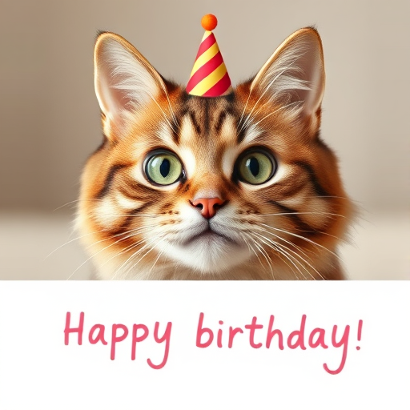
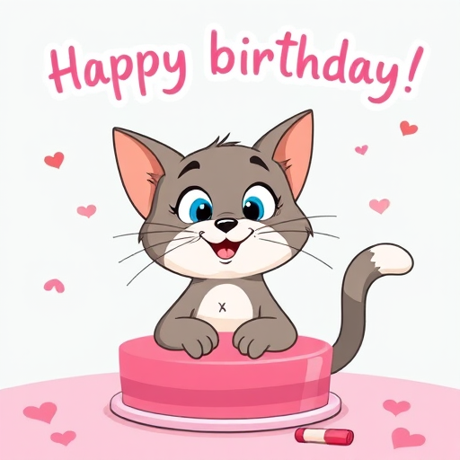

# Create Fun images Using LORA Adapters on AI Studio
  - [Overview](#overview)
  - [Pre-Requisites](#pre-requisites)
  - [Quick start](#quick-start)
  - [Example 2](#example-2)
  - [Example 3](#example-3)
  - [Dev Notes](#dev-notes)


## Overview

You can use LORA adapters in [Nebius AI Studio](https://studio.nebius.com/) UI.  This example shows how to create some cool images using this feature.

**Watch the video**

[](https://www.youtube.com/watch?v=f060_TGIeMg)

## Pre-Requisites

- Nebius Studio account.  Get a free one [here](https://studio.nebius.com/)

## Quick start

### 1 - Select a model

- Go to [Nebius AI Studio](https://studio.nebius.com/)
- Selet 'Text to image' section
- And select a model **`FLUX.1-schnell`**

| 
|-

<!-- ### 2 - Create a base image

Prompt:

> create a birthday card of a kid saying "happy birthday" 

And here the image

 -->

### 2 - Using a LORA Adapter

One of the best places to find LORA adapters is [civitai.com](https://civitai.com/)

To use a LORA adapter, we need 

- the model adapter URL
- and 'trigger word'

The trigger word should be part of the prompt.  

For example, if the trigger word is **XYZ**  the prompt would be

> XYZ a cat wearing sun glasses
  
See the screen shot on how to find these.

| 
|-

Here are some cool adapters:

- [lego minifugures](https://civitai.com/models/1658853/lego-minifigures?modelVersionId=1877566)
- [Simpsons](https://civitai.com/models/1257887?modelVersionId=1548033 )
- [Star Wars jedi outfit](https://civitai.com/models/32047?modelVersionId=1093173)
- [Tom and Jerry style](https://civitai.com/models/1541606?modelVersionId=1745171)

### 3 - Let's use a **Star wars JEDI** theme.

LORA adapter: [jedi outfit](https://civitai.com/models/32047?modelVersionId=1093173)

Trigger word: **Jedioutfit**

Prompt:

> Jedioutfit create a birthday card of a kid saying "happy birthday" 

Here is how we plug in the values:

| 
|-

Here are the generated image.


| 
|-

Pretty cool, eh?!


### 4 - Let's try 'simpsons' style

Adapter: [Simpsons](https://civitai.com/models/1257887?modelVersionId=1548033)

Trigger word (one of many): **bart_simpsons**

Prompt:

> bart_simpsons  create a birthday card of a kid saying "happy birthday" 

And here are couple of images generated:

| 
|-

| 
|-

---

## Example 2

**1 - Start with a plain image.**

Prompt:

> a birthday card of cat saying "happy birthday"  

| 
|-

**2 - Use a cartoon style LORA.**

[Tom and Jerry style](https://civitai.com/models/1541606?modelVersionId=1745171)

Trigger words: **A mhls_cartoon style**

Prompt:

> A mhls_cartoon style image  a birthday card of cat saying "happy birthday"

| 
|-

---

## Example 3

---

Have fun!

## Dev Notes

How to combine multiple images into a single image.

```bash
## side by side
convert image1.jpg image2.jpg image3.jpg +append combined_horizontal.jpg

## vertically
convert image1.jpg image2.jpg image3.jpg -append combined_vertical.jpg

## Grid layout (2x2 example)
convert image1.jpg image2.jpg image3.jpg image4.jpg -resize 500x500 \( image1.jpg image2.jpg +append \) \( image3.jpg image4.jpg +append \) -append grid.jpg
```