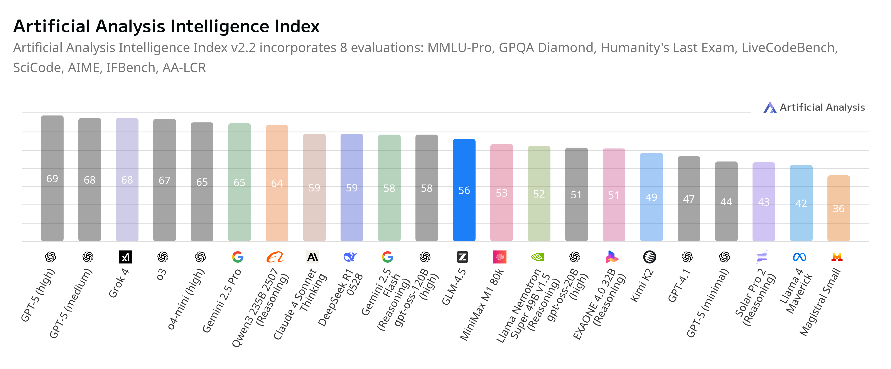
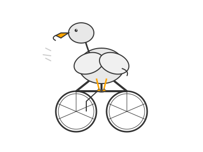

# GLM4.5 is here!

**Published:** August 08, 2025

> ⭐ If you find this repo useful, give it a star! You’ll be notified of new updates and help others discover it too — thank you!

---

## Table of Contents

  - [Try it Out](#try-it-out)
  - [TL;DR](#tldr)
  - [Performance and Benchmarks](#performance-and-benchmarks)
    - [Official benchmarks](#official-benchmarks)
    - [Artificial Analysis Benchmark](#artificial-analysis-benchmark)
    - [Fun Benchmark: "Pelican riding a bicycle"](#fun-benchmark-pelican-riding-a-bicycle-)
  - [References](#references)

## Try it Out!

[Try it in the AI Studio playground](https://studio.nebius.com/playground?models=zai-org/GLM-4.5)  (GLM4.5)

[Try it in the AI Studio playground](https://studio.nebius.com/playground?models=zai-org/GLM-4.5-Air)  (GLM-4.5-Air)

Try with API:  [glm4.5_1.ipynb](glm4.5_1.ipynb)  &nbsp; 

## TL;DR

 GLM-4.5 is Z.ai's breakthrough open-source AI model. Unifying reasoning, coding, and agentic capabilities in a single foundation model designed specifically for intelligent agents

- Released: July 2025
- Two models: 
  - [GLM-4.5](https://huggingface.co/zai-org/GLM-4.5): 355 billion total parameters with 32 billion active parameters using Mixture-of-Experts (MoE) architecture 
  - [GLM-4.5-Air](https://huggingface.co/zai-org/GLM-4.5-Air): More compact design with 106 billion total parameters and 12 billion active parameters
- **128K context length** with native function calling capacity
- **Hybrid Reasoning System**: "Thinking mode" for complex reasoning and tool usage, and "non-thinking mode" for instant responses 
- License: Released under **MIT open-source license**, allowing unlimited commercial use and secondary development 

### 🧠 Fun Facts

**The "Slime" Secret Sauce**

Z.ai actually built their reinforcement learning infrastructure and called it "slime". This RL infrastructure is engineered for exceptional flexibility, efficiency, and scalability and helps GLM-4.5 learn complex agentic behaviors.

**The Crown-Passing Championship**

Within just a couple of weeks, the crown of "best open-source model" went from Kimi-K2 to Qwen3, and now to GLM-4.5! - [source](https://medium.com/data-science-in-your-pocket/glm-4-5-the-best-open-source-ai-model-beats-kimi-k2-qwen3-b56a5df2ec34)

---

## Performance and Benchmarks

### Official benchmarks

| 
|-

[See more here](https://huggingface.co/zai-org/GLM-4.5)

### Artificial Analysis Benchmark

| 
|-

[AA analysis](https://artificialanalysis.ai/models/glm-4.5)

### Fun Benchmark: "Pelican riding a bicycle" 🪿🚲

Inspired by [Simon Willison](https://simonwillison.net/)'s fun experiment ([see here](https://simonwillison.net/tags/pelican-riding-a-bicycle/)), this benchmark is all about how well models generate quirky, imaginative responses.

Prompt:

> Generate an SVG of a pelican riding a bicycle

You can see our full pelican tests [here](../fun/pelican-riding-bicycle/).

So how does GLM do?  Let's see.

**GLM-4.5** 

| 
|-

**GLM-4.5-Air** 

| 
|-

#### Comparing against other SOTA OS models

**glm-4.5  vs gpt-oss  vs qwen3-235B-2507 vs  deepseek-r1-0528**

|
|-

## References

- [Z.ai GLM](https://z.ai/blog/glm-4.5)
- [GLM-4.5](https://huggingface.co/zai-org/GLM-4.5): 355 billion total parameters with 32 billion active parameters using Mixture-of-Experts (MoE) architecture 
- [GLM-4.5-Air](https://huggingface.co/zai-org/GLM-4.5-Air): More compact design with 106 billion total parameters and 12 billion active parameters