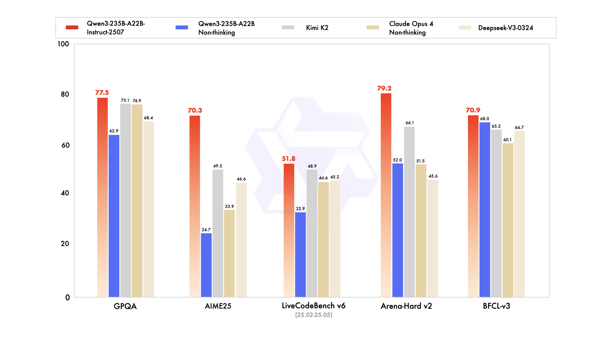
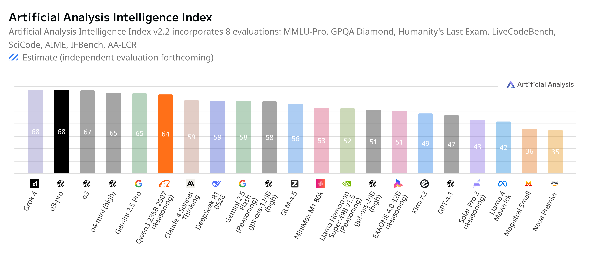
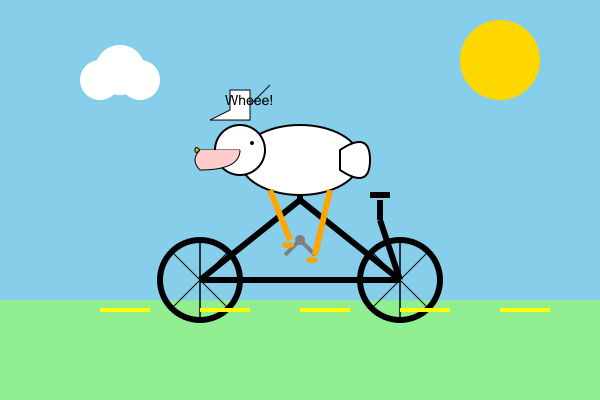

# Qwen3-235B-A22B-2507 is Here!

**Published:** August 5, 2025

> ⭐ If you find this repo useful, give it a star! You’ll be notified of new updates and help others discover it too — thank you!

---

## Table of Contents

  - [Try it Out!](#try-it-out)
  - [TL;DR](#tldr)
  - [Performance and Benchmarks](#performance-and-benchmarks)
    - [Official Benchmark](#official-benchmark)
    - [Artificial Analysis](#artificial-analysis)
    - [Fun ‘Vibe’ Benchmark 🪿🚲](#fun-vibe-benchmark-)
  - [References](#references)

---

## Try it Out!

[Try it in the AI Studio playground](https://studio.nebius.com/playground?models=Qwen/Qwen3-235B-A22B-Instruct-2507)  (instruct model)

Try with API: [qwen3\_2507\_1.ipynb](qwen3_2507_1.ipynb) &nbsp;

---

## TL;DR

* **Qwen3-235B-A22B-2507** (released July 2025) is the updated version of **Qwen3-235B-A22B** (April 2025).
* Two separate model variants are now available:

  * [Thinking model](https://huggingface.co/Qwen/Qwen3-235B-A22B-Thinking-2507)
  * [Instruct model](https://huggingface.co/Qwen/Qwen3-235B-A22B-Instruct-2507)
* This marks a shift from the hybrid "Thinking" mode used in previous releases.
* From the Qwen team ([source](https://www.linkedin.com/feed/update/urn:li:activity:7353110351388819457/)):

  > “After talking with the community and thinking it through, we decided to stop using hybrid thinking mode. Instead, we’ll train Instruct and Thinking models separately so we can get the best quality possible.”
  >
  > “A small update to Qwen3-235B-A22B, but a big improvement in quality!”

### Highlights:

* Released: July 2025
* 235B total parameters / 22B active (Mixture of Experts architecture)
* Native 262K token context window
* Strong performance on math, logic, and coding tasks
* Outperforms Kimi K2 (1T params) and Claude Opus 4 (Non-Thinking) in several key benchmarks
* Try it on [Nebius AI Studio](https://studio.nebius.com/playground?models=Qwen/Qwen3-235B-A22B-Instruct-2507)
* License: Apache 2.0

### 🧠 Fun Fact

Qwen3-235B-A22B-2507 uses a **Mixture of Experts (MoE)** architecture with 235B total parameters — but only **22B are active** at any given time!
So you get massive model performance with much lower compute costs. Smart *and* efficient 💡⚡

---

## Performance and Benchmarks

### Official Benchmark

📊 From the Qwen team:

[Source](https://huggingface.co/Qwen/Qwen3-235B-A22B-Instruct-2507)

---

### Artificial Analysis

According to Artificial Analysis, Qwen3 is currently the **top-performing open-source model** — and it’s getting close to matching proprietary SOTA models.

[Source](https://artificialanalysis.ai/models/qwen3-235b-a22b-instruct-2507-reasoning)

---

### Fun ‘Vibe’ Benchmark 🪿🚲

Let’s talk about something a little more whimsical: the **Pelican Riding a Bicycle** test. Inspired by [Simon Willison](https://simonwillison.net/)'s fun experiment ([see here](https://simonwillison.net/tags/pelican-riding-a-bicycle/)), this benchmark is all about how well models generate quirky, imaginative responses.

Prompt:

> Generate an SVG of a pelican riding a bicycle

You can see our full pelican tests [here](../fun/pelican-riding-bicycle/).

So how did the new model do?

#### Old Version: Qwen3-235B-A22B (April 2025)

#### New Version: Qwen3-235B-A22B-Instruct-2507 (July 2025)

**Not bad, right?** 😎

---

## References

* [GitHub: QwenLM/Qwen3](https://github.com/QwenLM/Qwen3)
* HuggingFace model pages:
  * [Thinking model](https://huggingface.co/Qwen/Qwen3-235B-A22B-Thinking-2507)
  * [Instruct model](https://huggingface.co/Qwen/Qwen3-235B-A22B-Instruct-2507)
* [Official announcement on LinkedIn](https://www.linkedin.com/feed/update/urn:li:activity:7353110351388819457/)
* [News coverage: Qwen3 breaks into Chatbot Arena Top 3](https://www.alizila.com/news-roundup-qwen3-undertakes-chatbot-arena-top-3-compact-qwen3-30b-series-launches-for-efficient-ai-development/?utm_source=linkedin&utm_medium=paid&utm_campaign=technology&utm_content=qwen3-top3-chatbot-arena)

---
