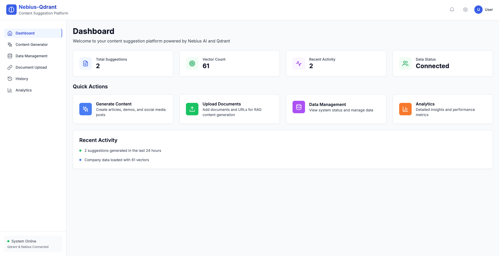

# Nebius-Qdrant Content Generation Platform

An AI-powered content generation platform that helps in creating social media posts, articles, and demo applications using a RAG pipeline built with Nebius and Qdrant Cloud vector database. 


## Quick Start

### Prerequisites
- Node.js 18+
- Nebius API key
- Qdrant Cloud account and API key

### Setup

1. **Clone and setup environment:**
```bash
git clone https://github.com/nebius/ai-studio-cookbook
cd rag/content-gen-pipeline-qdrant
cp backend/env.example backend/.env
cp frontend/env.example frontend/.env
```

2. **Configure environment variables:**
```bash
# Backend (.env)
PORT=3001
NODE_ENV=development
QDRANT_URL=https://your-cluster-id.us-east-1-0.aws.cloud.qdrant.io:6333
QDRANT_API_KEY=your_qdrant_cloud_api_key_here
NEBIUS_API_KEY=your_nebius_api_key_here
CORS_ORIGIN=http://localhost:3000

# Frontend (.env)
REACT_APP_API_BASE_URL=http://localhost:3001
REACT_APP_API_TIMEOUT=30000
```

3. **Start the application:**
```bash
cd backend && npm install && npm start
cd frontend && npm install && npm start
```

## Current Workflows

The platform supports two main workflows for content generation:

### 1. Content Generation Workflow
**Purpose**: Generate AI-powered content suggestions for various content types with optional document context.

**Content Types**:
- **Social Media Posts**: Generate engaging posts for LinkedIn, Twitter, Instagram, etc.
- **Articles**: Create blog posts and articles with structured content
- **Demo Applications**: Generate demo ideas and application concepts

**Process**:
1. Select content type (social media, article, or demo)
2. Add optional goals or requirements
3. Optionally provide document context for RAG-enhanced generation
4. AI generates multiple suggestions with:
   - Titles and descriptions
   - Key points or features
   - Target audience
   - Platform recommendations
   - Engagement strategies

**Features**:
- Uses Nebius AI Studio (Llama-3.3-70B-Instruct model for generation, Qwen/Qwen3-Embedding-8B for embeddings)
- RAG-enhanced generation using uploaded document context
- Provides formatted, ready-to-use content
- Stores generation history

### 2. Document Upload & Processing Workflow
**Purpose**: Upload and process documents to provide context for RAG-enhanced content generation.

**Supported Formats**:
- Text files (.txt, .md, .docx)
- URLs (web pages)

**Process**:
1. Upload documents through the web interface
2. Automatic content extraction and processing
3. Document chunking (1000 words with 200-word overlap)
4. Vector embedding generation using Nebius AI Studio (Qwen/Qwen3-Embedding-8B)
5. Storage in Qdrant Cloud vector database
6. Context retrieval for content generation

**Features**:
- Automatic content extraction from URLs
- Intelligent document chunking
- Vector embedding for semantic search using Nebius Embedding Qwen/Qwen3-Embedding-8B model
- UUID-based point IDs for reliability
- Context-aware content generation

## Local Development

### Development Setup

1. **Clone the repository:**
```bash
git clone <repository-url>
cd nebius-qdrant
```

2. **Install dependencies:**
```bash
# Backend dependencies
cd backend
npm install

# Frontend dependencies
cd ../frontend
npm install
```

3. **Configure environment:**
```bash
# Copy environment files
cp backend/env.example backend/.env
cp frontend/env.example frontend/.env

# Edit backend/.env with your API keys
NEBIUS_API_KEY=your_nebius_api_key
QDRANT_URL=https://your-cluster-id.us-east-1-0.aws.cloud.qdrant.io:6333
QDRANT_API_KEY=your_qdrant_cloud_api_key
```

4. **Start development servers:**
```bash
# Terminal 1: Backend
cd backend
npm start

# Terminal 2: Frontend
cd frontend
npm start
```

### Development URLs
- **Frontend**: http://localhost:3000
- **Backend API**: http://localhost:3001

### Development Features
- Hot reloading for both frontend and backend
- Real-time API testing
- Vector database management via Qdrant Cloud
- Content generation history
- Document processing logs

## Project Structure

```
nebius-qdrant/
├── backend/                 # Node.js API server
│   ├── src/
│   │   ├── controllers/     # API endpoints
│   │   │   ├── contentController.js    # Content generation logic
│   │   │   ├── dataController.js       # Document upload & management
│   │   │   └── feedbackController.js   # User feedback handling
│   │   ├── services/        # Business logic
│   │   │   ├── nebiusService.js        # Nebius AI integration
│   │   │   ├── qdrantService.js        # Qdrant Cloud operations
│   │   │   ├── embeddingService.js     # Nebius AI embeddings
│   │   │   └── documentService.js      # Document processing
│   │   └── utils/          # Utilities
│   │       └── formatter.js            # Response formatting
│   ├── examples/           # Usage examples
│   │   └── rag-usage-example.js        # RAG workflow demo
│   └── uploads/            # Temporary file storage
├── frontend/               # React application
│   ├── src/
│   │   ├── components/     # React components
│   │   │   ├── DocumentUpload.js       # File upload interface
│   │   │   ├── Header.js               # Navigation header
│   │   │   └── Sidebar.js              # Side navigation
│   │   ├── pages/         # Page components
│   │   │   ├── Dashboard.js            # Main dashboard
│   │   │   ├── ContentGenerator.js     # Content generation UI
│   │   │   ├── DataUpload.js           # Document management
│   │   │   ├── Analytics.js            # Usage analytics
│   │   │   └── History.js              # Generation history
│   │   └── services/      # API client
│   │       └── api.js                  # API integration
│   └── public/            # Static assets
└── docker-compose.yml     # Docker configuration (backend + frontend only)
```

## API Endpoints

### Content Generation
- `POST /api/content/suggest` - Generate content suggestions with optional RAG context
- `GET /api/content/stats` - Get content statistics
- `GET /api/content/history` - Get generation history

### Data Management
- `POST /api/data/company` - Upload company data
- `POST /api/data/files` - Upload documents
- `POST /api/data/links` - Upload URLs
- `GET /api/data/documents` - Get uploaded documents
- `GET /api/data/stats` - Get data statistics

### Feedback
- `POST /api/feedback` - Submit user feedback

## Features

- **AI-Powered Content**: Uses Nebius AI Studio (Llama-3.3-70B-Instruct for generation, Qwen/Qwen3-Embedding-8B for embeddings) for high-quality content generation
- **RAG-Enhanced Generation**: Context-aware content creation using uploaded documents
- **Document Processing**: Automatic chunking, embedding, and storage
- **Vector Search**: Qdrant Cloud integration for semantic search and context retrieval
- **Modern UI**: Clean, responsive React interface with Tailwind CSS
- **Real-time Processing**: Live content generation and document processing
- **Multi-format Support**: Text files, URLs, JSON, and CSV processing
- **History Tracking**: Complete generation history and analytics

