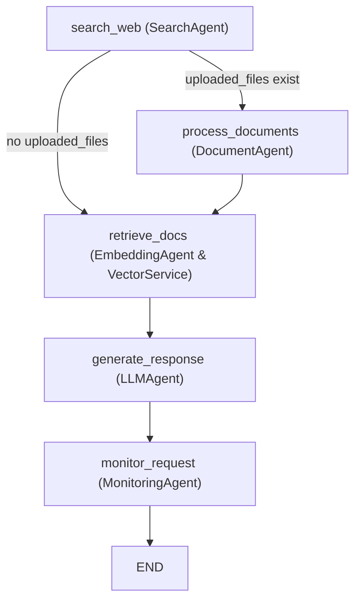

<div align="center">
  <h1>Internal Support Agent</h1>
 
  
</div>

Internal Support Agent is a Retrieval-Augmented Generation (RAG) assistant combining web search, document processing, vector retrieval, and intelligent support tools. It features multi‑agent orchestration, automatic support assessment, and integrations with Notion and Calendly. The project provides both a Streamlit web app and a Slack bot.

---

## Features

- **Web Search**: Real-time information retrieval via Exa.ai.
- **Document Processing**: Upload and process `.txt`, `.pdf`, `.docx`, and `.md` files.
- **Vector Storage**: Efficient chunking and storage in Weaviate.
- **LLM Generation**: Advanced reasoning using Nebius Studio models.
- **Intelligent Support**: Auto assessment and proactive support via Notion and Calendly.
- **Slack Integration**: DMs, channel `@mentions`, and `/rag` command.
- **Streamlit Frontend**: Modern dark‑themed chat UI and document management.
- **Retrieval Controls**: Sidebar sliders for web results, vector docs limit, and relevance threshold.
- **Response Analytics (Streamlit only)**: Optional per‑message stats in the UI.
- **Database Tools**: Weaviate health check, stats, wipe collection, and add sample document.
- **Manual Support**: Create support requests from the sidebar.

---

## Architecture

### Main Components

- **Agents**: Modular agents for search, embedding, document processing, LLM generation, and monitoring.
- **Workflow**: Stateful orchestration using LangGraph (`graph/workflow.py`).
- **Support Tools**: LangChain-style tools for Notion ticketing and Calendly scheduling (`tools/tools_notion_and_cal.py`).
- **Environment Integration**: Uses Nebius Studio, Exa.ai, Weaviate, Notion, Calendly.

### Workflow State

The workflow state is defined in [`graph.state.WorkflowState`](graph/state.py).

---

## Agents Flow Diagram



**Flow Explanation:**
- **search_web**: Uses `SearchAgent` to fetch web results.
- If files are uploaded, `DocumentAgent` processes them, then proceeds to document retrieval.
- If no files, goes directly to `retrieve_docs` using `EmbeddingAgent` and `VectorService`.
- `LLMAgent` generates the final response.
- `MonitoringAgent` logs the request before workflow ends.

---

## Getting Started

### Prerequisites

- Python 3.10+
- API keys for Nebius Studio, Exa.ai, Weaviate, Notion, Calendly, Slack

### Installation

1) Clone the repository
```sh
git clone https://github.com/your-org/nebius-support-agent.git
cd nebius-support-agent
```

2) Install uv (recommended)
```sh
# macOS/Linux
curl -LsSf https://astral.sh/uv/install.sh | sh
# Windows (PowerShell)
irm https://astral.sh/uv/install.ps1 | iex
```

3) Create and activate a virtual environment
```sh
uv venv
source .venv/bin/activate  # Windows: .venv\\Scripts\\activate
```

4) Install dependencies (from `pyproject.toml`)
```sh
uv sync
```

5) Configure environment variables
- Create a `.env` in the project root and fill in keys listed in “Environment Variables”.

### Running the App

- **Streamlit Frontend**
```sh
uv run streamlit run app.py
```

- **Slack Bot** (DMs, `@mentions`, `/rag`)
```sh
uv run slack_bot.py
```

---

## Usage

### Document Upload

- Upload documents via the Streamlit interface.
- Documents are chunked, embedded, and stored in Weaviate for retrieval.

### Chat & Support

- Ask questions in the Streamlit chat or Slack.
- The AI can trigger support actions (e.g., Notion tickets, Calendly scheduling) when appropriate.

### Retrieval Settings (Sidebar)
- Control web search results, vector document limit, and minimum vector relevance threshold.
- These values affect the current run of the workflow (`web_search_limit`, `doc_retrieval_limit`, `min_vector_relevance`).

### Response Analytics (Streamlit only)
- Expand “Response Analytics” under a message to view:
  - Search results count, retrieved docs count, generation time
  - Tools used (web_search, notion_append_entry, cal_create_booking)
  - Effective limits and vector relevance metrics
> Note: Slack responses intentionally do not include internal logs or stats.

### Database Management
- Get Weaviate stats and health.
- Clear the collection (wipe) and clear chat history.
- Optionally add a sample document to the vector DB for quick testing.

### Manual Support
- If a user email is set, you can create a manual support request from the sidebar.

---

## Project Structure

```
.env
app.py
config.py
pyproject.toml
uv.lock
slack_bot.py
slack_test.py
assets/
    langgraph_logo.png
    logo.png
    notion.png
    weavite.png
agents/
    document_agent.py
    embedding_agent.py
    llm_agent.py
    monitoring_agent.py
    search_agent.py
graph/
    state.py
    workflow.py
services/
    vector_service.py
tools/
    support_tools.py
    tools_notion_and_cal.py
```

- [`app.py`](app.py): Streamlit frontend
- [`slack_bot.py`](slack_bot.py): Slack bot integration
- [`agents/`](agents/): Modular agent implementations
- [`graph/`](graph/): Workflow orchestration
- [`services/vector_service.py`](services/vector_service.py): Vector database service
- [`tools/`](tools/): Support tool integrations
- [`config.py`](config.py): Configuration and environment variables

---

## Environment Variables

Create `.env` and set:
- **Required**: `NEBIUS_API_KEY`, `EXA_API_KEY`, `WEAVIATE_URL`, `WEAVIATE_API_KEY`
- **Slack**: `SLACK_BOT_TOKEN`, `SLACK_APP_TOKEN`, `SLACK_SIGNING_SECRET`
- **Notion (support)**: `NOTION_API_KEY`, `NOTION_DATABASE_ID`
- **Calendly (support)**: `CALENDLY_API_KEY` (or legacy `CAL_API_KEY`), `CALENDLY_EVENT_TYPE_ID`, `CALENDLY_USERNAME`
- **Optional**: `KEYWORDS_AI_API_KEY`

Defaults/tuning (optional):
- `DEFAULT_WEB_RESULTS` (default 5)
- `DEFAULT_DOCS_RETRIEVAL` (default 5)
- `DEFAULT_MIN_VECTOR_RELEVANCE` (default 0.7)

Model defaults (from `config.py`):
- `LLM_MODEL = "zai-org/GLM-4.5"`
- `EMBEDDING_MODEL = "Qwen/Qwen3-Embedding-8B"`

To change models, open `config.py` and edit `LLM_MODEL` and/or `EMBEDDING_MODEL` to the desired Nebius Studio identifiers.

---

## Support & Maintenance

- Optional support ticket creation for errors (if user email is available).
- Manual support requests via Streamlit sidebar.
- Vector database and chat history maintenance tools.

## Troubleshooting

- **Slack SSL certificate error on macOS** (`SSL: CERTIFICATE_VERIFY_FAILED`):
  - Run Apple’s certificate installer for your Python: `Install Certificates.command` (e.g., `/Applications/Python\ 3.13/Install\ Certificates.command`).
  - Or ensure `certifi` is installed and up to date.

- **Missing environment variables in Streamlit**: The app shows a guided checklist in the UI; add the listed keys to `.env` and restart.

