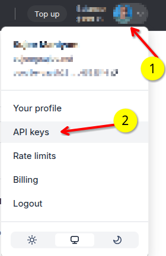
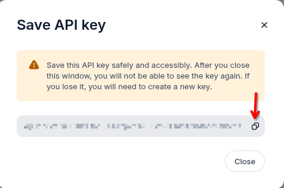

# Setting up Dev Environment

## 1 - Clone the repo

```bash
git   clone    https://github.com/nebius/ai-studio-cookbook/
cd    ai-studio-cookbook
```

## 2 - Get Nebius API Key

To run most of the examples in this repo, you will need a **Nebius API Key**.  Here is how to get it.

1) Go to [studio.nebius.com](https://studio.nebius.com/)

2) Click on your profile and go to API Keys section



3) Click on 'Get API Key'

4) Give a name for the key (e.g. 'examples1')

5) Be sure to save the key before closing the dialog window



## 3 - Google Colab

If you are using Google Colab environment no need to setup a python environment. 

Add NEBIUS API KEY as follows (one time setup).

1.  Go to [Google Colab](https://colab.research.google.com/)
2.  Click on **Secrets** tab on left 
3.  Add a new secret **NEBIUS_API_KEY** and set the value
4.  Toggle 'Notebook access' button


## 4A -  Local Python Development Environment Setup

Follow the steps below for setting up a local python environment.

**Option 1 (Recommended): Using Anaconda / mini-forge**

```bash
conda create -n studio-1 python=3.11
conda activate studio-1
```

**Option 2: Using Python venv**

```bash
python -m venv .venv
source .venv/bin/activate
```

**Option 3: using UV**

```bash
uv venv --python 3.11
source .venv/bin/activate
```

Once the environment is setup, install project specific dependencies as follows

```bash
pip install -r requirements.txt
# uv pip install -r requirements.txt
```

## 4B - Setup `.env` configuration file (for Local Setup)

Use the provided `env_sample.txt` file as starter

```bash
cp   env_sample.txt   .env
```

Add your key in `.env` file as follows:

```text
NEBIUS_API_KEY=your_api_key_here
```