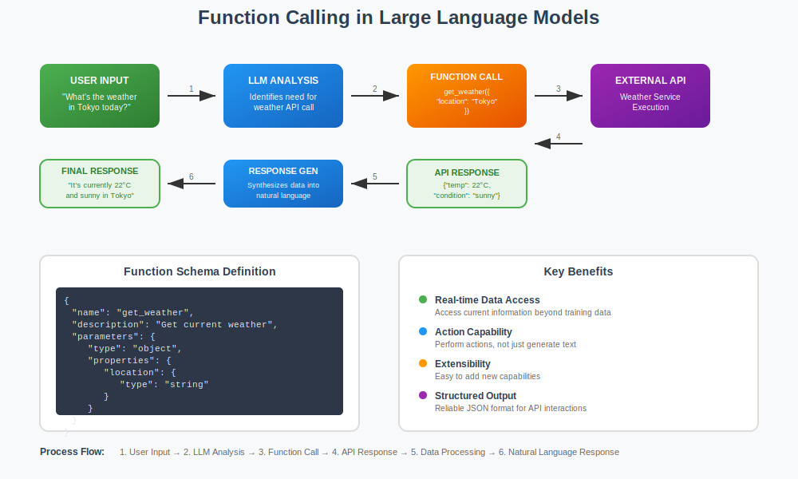

# Function Calling Explained

Function calling (also known as tool calling) is a capability that allows Large Language Models to interact with external systems, APIs, and tools by generating structured function calls based on natural language requests.

## How Function Calling Works

The process involves several key steps:

**1. Function Definition**: Developers define available functions with schemas that specify parameters, types, and descriptions. The LLM receives these function definitions as part of its context.

**2. Intent Recognition**: When a user makes a request, the LLM analyzes the input to determine if it needs to call external functions to fulfill the request.

**3. Function Call Generation**: If needed, the LLM generates structured function calls with appropriate parameters in a standardized format (typically JSON).

**4. Execution & Response**: The system executes the function calls and returns results, which the LLM then uses to formulate a final response to the user.

Let me create a visual diagram to illustrate this process:## Key Technical Concepts

**Function Schemas**: These are JSON-based descriptions that tell the LLM what functions are available, what parameters they accept, and what they do. The schema acts as documentation that helps the LLM understand when and how to use each function.

**Parameter Extraction**: The LLM must intelligently extract relevant information from natural language and map it to the correct function parameters. For example, "What's the weather like in Paris tomorrow?" needs to extract location="Paris" and potentially date="tomorrow".

**Multi-step Reasoning**: Complex requests may require multiple function calls in sequence. The LLM can chain function calls together, using the output of one function as input to another.

**Error Handling**: Modern function calling implementations include retry mechanisms and error handling, allowing the LLM to adapt when function calls fail or return unexpected results.

## Advantages Over Traditional Approaches

Function calling represents a significant advancement over earlier methods like prompt engineering with specific output formats. It provides:

- **Structured Output**: Guaranteed JSON format eliminates parsing errors
- **Type Safety**: Parameter validation prevents many runtime errors  
- **Better Reliability**: Standardized interfaces reduce ambiguity
- **Easier Integration**: Direct mapping to existing APIs and systems

This capability transforms LLMs from pure text generators into interactive agents that can perform real-world tasks, making them much more practical for business applications and complex workflows.